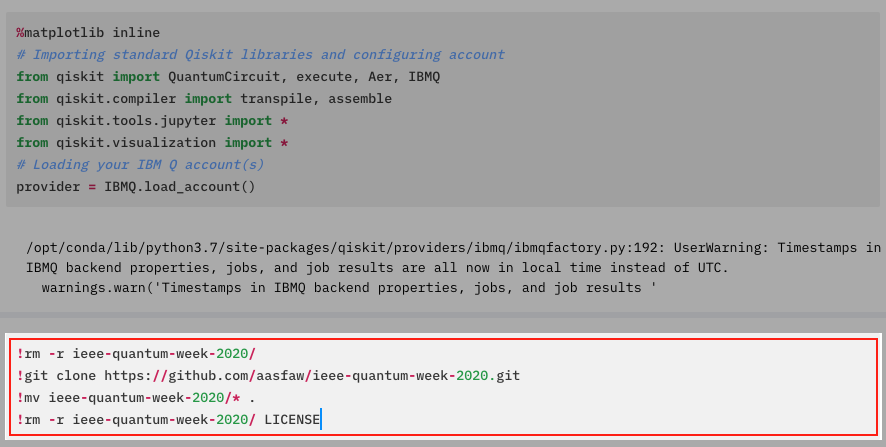
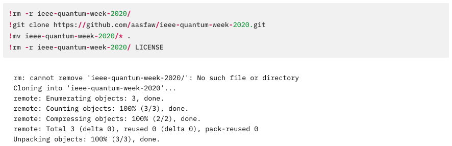
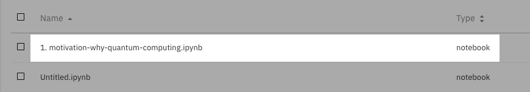

# Tutorial on Quantum Programming: An Introduction

This tutorial will be given by Abraham Asfaw, Global Lead of Quantum Education & Open Science at IBM Quantum. It will be a largely hands-on introduction to quantum programming, covering key concepts and introducing quantum computing pedagogically in a top-down approach focusing on quantum computing applications as a starting point. The tutorial is geared toward an audience of engineers and computer scientists, and no background knowledge of quantum computing or quantum mechanics is assumed. While familiarity with programming, particularly in Python, will be useful, it is not necessary since all the code samples are provided in this repository.

The schedule for this tutorial is as follows. (NOTE: All times are US Mountain Daylight Time, UTC-6.)

### Session 1 (1045 - 1215): Motivation: why quantum computing?

* 1045 - 1145: Talk

* 1145 - 1215: Live Session
    * Hands-on: Joining the IBM Quantum Experience and running your first quantum circuit
    * Q & A

### Session 2 (1300 - 1430): Elements of quantum programming

* 1300 - 1400: Talk
    * Top-down introduction to quantum programming using Qiskit
    * Key quantum operations and circuits
    * Combining quantum operations and circuits into programs
    * Running quantum programs

* 1400 - 1430: Live Session
    * Hands-on Coding: Building a quantum program for unstructured search
    * Q & A

### Session 3 (1515 - 1645): Modern quantum programs

* 1515 - 1615: Talk and live programming
    * Building variational eigensolvers using Qiskit
    
* 1615 - 1645: Live Session
    * Hands-on Coding: Running a variational eigensolver using Qiskit
    * Q & A

# Instructions for running these notebooks

The best way to run these notebooks is by using the IBM Quantum Experience. Follow these instructions to do so.

1. Go to the IBM Quantum Experience at [https://quantum-computing.ibm.com/](https://quantum-computing.ibm.com/) and log in. If you haven't done so before, you will need to create an account.

2. Once you have logged into the IBM Quantum Experience, click the `Quantum Lab` button on the left navigation bar shown in the image here: .

3. Click the `New Notebook` button shown in the image here: 

4. In the new notebook, paste the following instructions in the empty cell as shown in the image here: 
```
!rm -r ieee-quantum-week-2020/
!git clone https://github.com/aasfaw/ieee-quantum-week-2020.git
!mv ieee-quantum-week-2020/* .
!rm -r ieee-quantum-week-2020/ LICENSE
```


5. Press `Shift+Enter`. It will take a moment for the instructions that you have pasted to execute. When they complete, you should get a message `Unpacking objects: 100%, done.` as shown in the image here: 

6. Once your instructions have executed, go back to the Quantum Lab page by clicking the `Quantum Lab` button on the left navigation bar shown in the image here: 

7. Now, you can click on one of the numbered notebooks to open it, as shown in the image here: 


